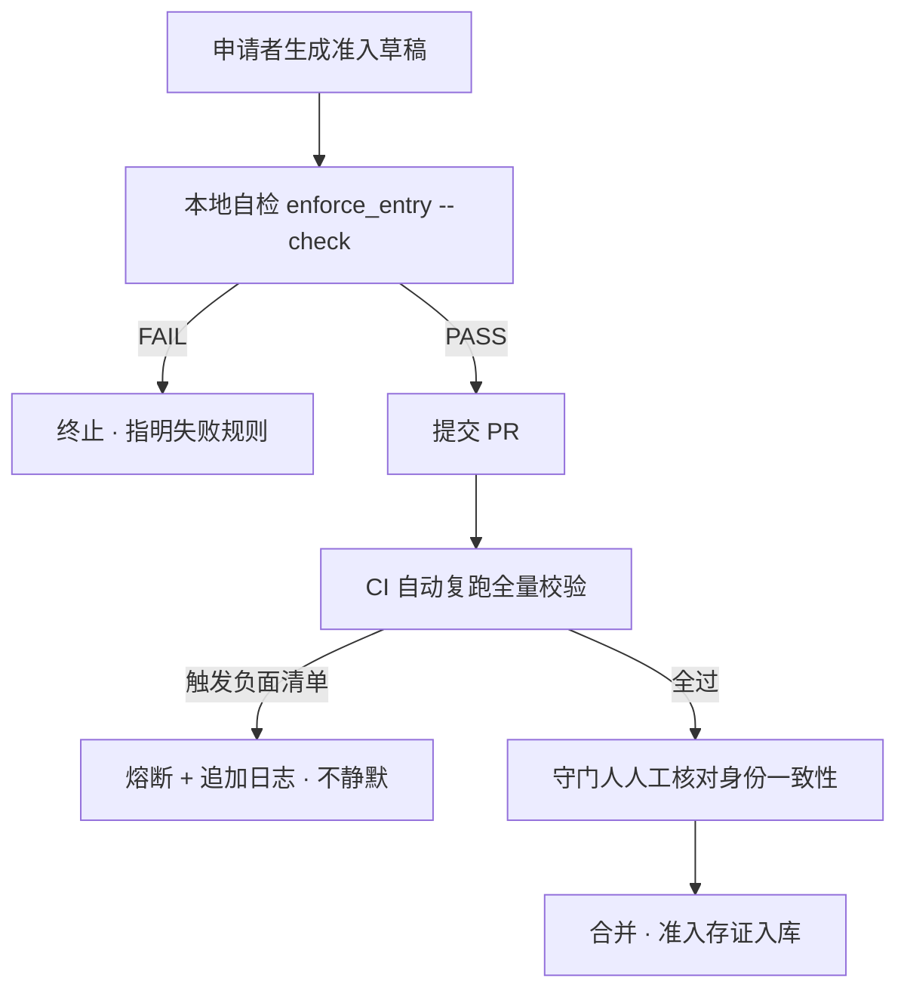

# PA-001 · 合规前置准入机制（防御性公开披露）

> **Disclosure Date**: 2026-09-16（UTC+8）
> **Public Commit**: `9c88f98`（github.com/henyi-tdca/tdca-protocol，main 分支）
> **性质**：防御性公开（defensive publication）。本文构成可供审查比对的现有技术资料；采信与否取决于受理机关。

---

## 一、技术目的

在协议参与者写入任何存证或贡献之前，强制执行机器可复算的合规前置校验：只有通过全部准入规则的提交才进入评审与合并流程；触发负面清单条款的提交立即熔断并留痕，不静默通过。其目的是把合规检查从「事后审查」前移为「准入前置」，使违规成本发生在写入之前。

## 二、输入 / 输出

- **输入**：准入申请文件（YAML，含申请者标识、协议条款接受声明、红线自述、来源性质标注）。
- **输出**：结构化校验结论（PASS / FAIL，逐规则列出）；熔断事件日志（追加写入，供守门人复核）；通过者方可进入后续人工核对与合并流程。

## 三、触发条件

1. 申请者本地生成准入申请草稿后，提交前自检（`--check`）；
2. 提交 Pull Request 后，持续集成门禁对新增准入文件自动复跑全量校验；
3. 任一规则不通过 ⟹ 流程终止于当前步骤，不进入下一环节。

## 四、执行流程

1. 结构校验：YAML 字段完整、编号格式合法且不冲突、类型字段正确；
2. 身份一致性校验：申请文件声明的账号与提交者一致；本人自签署、不可代签；
3. 条款完备性校验：基协议逐项列出且均为接受状态；红线清单非空且含负空间条款；
4. 性质标注校验：来源性质字段固定为模拟态（真实态缔约未开放）；
5. 负面清单熔断：对禁词逐行扫描；禁词若处于含否定标记的行内（合规自述语境）则豁免，否则立即熔断；熔断事件追加写入日志，**不静默**；
6. 全部通过 ⟹ 输出 PASS；任一失败 ⟹ 输出 FAIL 并指明规则号。

## 五、实施例（公开仓代码）

- 准入校验器：`tools/enforce_entry.py`（规则 R1~R10 各自独立函数实现，逐条可测试、可审查；熔断日志写入 `nca-archives/.nsfl-log/`）。
- CI 门禁复跑：`.github/workflows/admission-check.yml`（对 `nca-archives/` 新增文件自动复跑全量校验）。
- 申请模板：`pack/templates/admit-nca-template.yaml`。

## 六、流程图

## 七、可实现性自查

| # | 项 | 结论 |
|---|---|---|
| ① | 技术目的 | §一 |
| ② | 输入/输出 | §二 |
| ③ | 触发条件 | §三 |
| ④ | 执行流程 | §四 |
| ⑤ | 实施例（公开仓代码路径） | §五（3 处路径，commit `9c88f98` 可核） |
| ⑥ | 状态机/流程图 | §六（Mermaid） |
| ⑦ | Disclosure Date ＋ 公开仓 commit | 文件头 |
