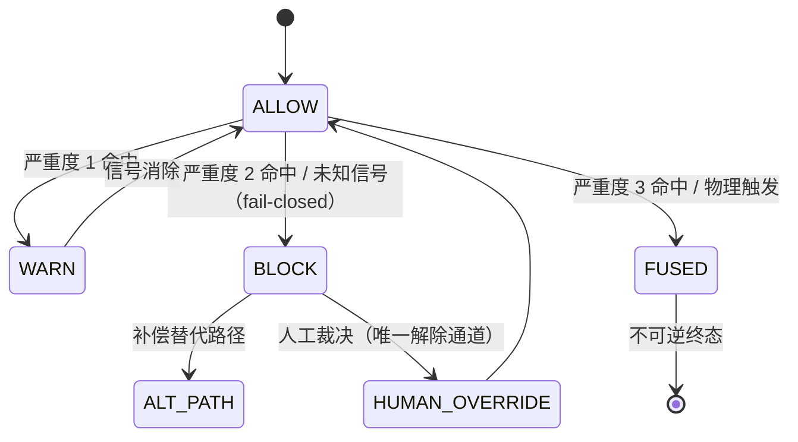

# PA-002 · 负空间熔断与补偿协同机制（防御性公开披露）

> **Disclosure Date**: 2026-09-16（UTC+8）
> **Public Commit**: `9c88f98`（github.com/henyi-tdca/tdca-protocol，main 分支）
> **性质**：防御性公开（defensive publication）。本文构成可供审查比对的现有技术资料；采信与否取决于受理机关。

---

## 一、技术目的

为协议运行时提供分级、可逆性分层的熔断机制：把禁止域（负空间）编码为类型系统可断言的规则，使非法状态迁移在类型层面即不可表达；熔断按严重度分级响应，并为可逆情形保留替代路径（补偿协同）与人工裁决通道，对未知信号采取 fail-closed（不默认放行）。

## 二、输入 / 输出

- **输入**：触发器标识（triggerID）＋ 信号串（signal）；规则表（匹配串 × 严重度 1/2/3）。
- **输出**：熔断裁决（状态、负空间类型、理由、可逆性标记、是否阻断）；熔断事实写入存证字段（`nsfl` 字段），供链上追溯。

## 三、触发条件

1. 任意运行时调用携带信号进入评估；
2. 信号命中规则表（按严重度分级）；
3. 信号未命中任何规则 ⟹ fail-closed，按阻断处理；
4. 物理层触发（硬件安全机制）⟹ 立即物理熔断，不可逆。

## 四、执行流程

1. 若引擎已处于 FUSED（熔断终态）⟹ 直接返回 FUSED，任何信号不再评估；
2. 逐规则匹配信号：
   - 严重度 1 ⟹ WARN（警示，不阻断）；
   - 严重度 2 ⟹ BLOCK（阻断，可经人工裁决解除）；
   - 严重度 3 ⟹ FUSED（熔断，不可逆）；
3. 未命中 ⟹ BLOCK（fail-closed，未知不放行）；
4. 补偿协同：BLOCK 状态下系统可进入 ALT_PATH（替代路径），以预定义的合规替代方案继续服务，而非简单停机；
5. 人工裁决：HUMAN_OVERRIDE 是解除 BLOCK 的唯一通道（快系统执行、慢系统裁决）；
6. 负空间类型分流：INSTITUTIONAL（制度负空间，可逆至 SUSPENDED 或不可逆 FUSED）／ PHYSICAL（物理负空间，不可逆）。

## 五、实施例（公开仓代码）

- 熔断引擎：`core-go/pkg/nsfl/nsfl.go`（`FuseEngine.Eval` 分级评估；`HumanOverride` 人工裁决通道；`PhysicalFuse` 物理熔断；并发安全）。
- 延迟阻断协同：`core-go/pkg/nsfl/latency.go`（超时路径强制返回 BLOCK，见 PA-004）。
- 断言终态协同：`core-go/pkg/nca/anchor.go`（被推翻断言不可物理删除，见 PA-003）。

## 六、状态机

## 七、可实现性自查

| # | 项 | 结论 |
|---|---|---|
| ① | 技术目的 | §一 |
| ② | 输入/输出 | §二 |
| ③ | 触发条件 | §三 |
| ④ | 执行流程 | §四 |
| ⑤ | 实施例（公开仓代码路径） | §五（3 处路径，commit `9c88f98` 可核） |
| ⑥ | 状态机/流程图 | §六（Mermaid） |
| ⑦ | Disclosure Date ＋ 公开仓 commit | 文件头 |
