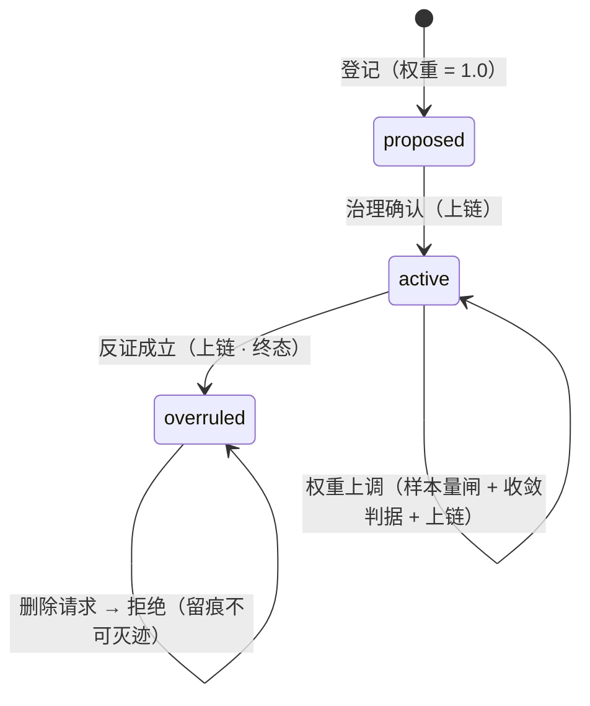

# PA-003 · 断言锚点三态状态机（防御性公开披露）

> **Disclosure Date**: 2026-09-16（UTC+8）
> **Public Commit**: `9c88f98`（github.com/henyi-tdca/tdca-protocol，main 分支）
> **性质**：防御性公开（defensive publication）。本文构成可供审查比对的现有技术资料；采信与否取决于受理机关。

---

## 一、技术目的

为「断言」（对事实或规则的主张）提供全生命周期可审计的锚定机制：断言经提案、生效、被推翻三态流转，全程留痕上链；被推翻的断言不可物理删除（推翻留痕、不可灭迹）；断言权重的默认值为不衰减，任何上调必须携带可审计的触发条件（样本量下限＋收敛判据）并写入存证链，防止静默调权。

## 二、输入 / 输出

- **输入**：断言内容（主题、主张文本、证据引用）、状态迁移请求、权重上调请求（附样本量与收敛判据）。
- **输出**：锚点记录（含三态、权重、时间戳、内容哈希）；迁移结果或拒绝原因；一切迁移与经证上调写入存证链（可验）。

## 三、触发条件

1. 新断言登记 ⟹ 进入 proposed（提案态）；
2. 治理确认 ⟹ active（生效态）；
3. 反证成立 ⟹ overruled（被推翻，终态）；
4. 权重上调请求 ⟹ 检查样本量是否达到下限且收敛判据成立，否则拒绝；
5. 删除请求指向 overruled 记录 ⟹ 拒绝（返回错误，记录保留）。

## 四、执行流程

1. 登记：生成内容哈希，状态 = proposed，权重 = 1.0（不衰减，默认锁定）；
2. 生效：状态迁移 proposed → active，迁移事件上链；
3. 推翻：状态迁移 active → overruled（终态），记录保留、可查询、不可删除；
4. 权重上调：仅在样本量 ≥ 下限且收敛判据满足时允许；上调幅度、证据、判据一并写入存证链；
5. 任何非法迁移（如 overruled → active、删除 overruled）⟹ 返回错误，状态不变。

## 五、实施例（公开仓代码）

- 三态状态机：`core-go/pkg/nca/anchor.go`（`AssertionAnchor`：三态常量、`ErrAnchorOverruledDelete` 删除拒绝、`IncreaseDecayRate` 样本量闸 `MinSampleSizeForIncrease` 与收敛判据；工程阈值就地标 SIMULATED 待实测校准）。
- 存证链承载：`core-go/pkg/nca/nca.go`（迁移事件作为记录上链，见 PA-005）。

## 六、状态机

## 七、可实现性自查

| # | 项 | 结论 |
|---|---|---|
| ① | 技术目的 | §一 |
| ② | 输入/输出 | §二 |
| ③ | 触发条件 | §三 |
| ④ | 执行流程 | §四 |
| ⑤ | 实施例（公开仓代码路径） | §五（2 处路径，commit `9c88f98` 可核） |
| ⑥ | 状态机/流程图 | §六（Mermaid） |
| ⑦ | Disclosure Date ＋ 公开仓 commit | 文件头 |
