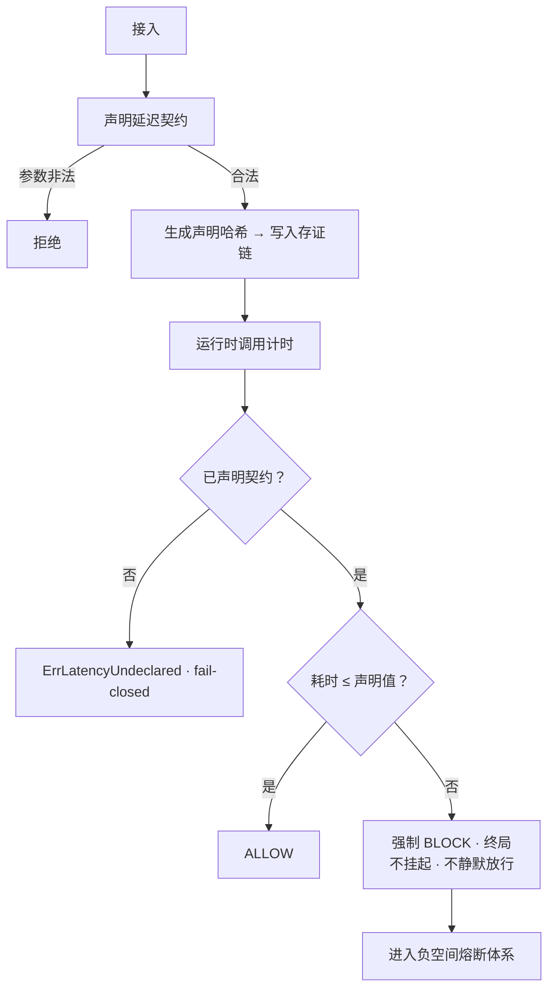

# PA-004 · 延迟代价与超时强制阻断机制（防御性公开披露）

> **Disclosure Date**: 2026-09-16（UTC+8）
> **Public Commit**: `9c88f98`（github.com/henyi-tdca/tdca-protocol，main 分支）
> **性质**：防御性公开（defensive publication）。本文构成可供审查比对的现有技术资料；采信与否取决于受理机关。

---

## 一、技术目的

把「响应延迟」从运维指标升格为契约义务：参与者须事先声明其最大延迟（max_latency），声明内容哈希写入存证链（上链可验、事后不可抵赖）；运行时一旦超过声明值，系统强制返回阻断终局——不得挂起、不得静默放行；未声明者不得启用超时判定（fail-closed）。由此使延迟产生可计量、可归责的代价。

## 二、输入 / 输出

- **输入**：延迟契约声明（契约标识 ＋ 最大延迟）；运行时实际耗时；触发器标识。
- **输出**：契约记录（含声明时间、声明内容哈希）；延迟判定结果（允许 / 阻断终局）；判定事件可写入存证链核验。

## 三、触发条件

1. 参与者接入前：须先声明延迟契约（声明即存证）；
2. 运行时每次调用：实际耗时与契约值比对；
3. 未声明契约而启用超时判定 ⟹ 返回错误（fail-closed，不默认放行）；
4. 实际耗时 > 声明值 ⟹ 强制阻断（终局性）。

## 四、执行流程

1. 声明：`DeclareLatencyContract(contractID, maxLatency)` —— 参数非法（空标识或非正值）⟹ 拒绝；合法 ⟹ 生成契约并计算声明内容哈希；
2. 锚定：`AnchorDeclaration` 将声明哈希作为记录写入存证链（上链可验之锚）；
3. 判定：`CheckLatency(elapsed, triggerID)` ——
   - 未声明 ⟹ 返回 `ErrLatencyUndeclared`；
   - 耗时 ≤ 声明值 ⟹ ALLOW；
   - 耗时 > 声明值 ⟹ 强制 StatusBlock（终局，理由含契约标识与实测值）；
4. 阻断事件进入负空间熔断体系（与 PA-002 协同）。

## 五、实施例（公开仓代码）

- 延迟契约：`core-go/pkg/nsfl/latency.go`（`LatencyContract`／`DeclareLatencyContract`／`AnchorDeclaration`／`CheckLatency`；契约数值就地标 SIMULATED，为工程目标值、待实测校准）。
- 熔断协同：`core-go/pkg/nsfl/nsfl.go`（`FuseResult`／`StatusBlock`，见 PA-002）。

## 六、流程图

## 七、可实现性自查

| # | 项 | 结论 |
|---|---|---|
| ① | 技术目的 | §一 |
| ② | 输入/输出 | §二 |
| ③ | 触发条件 | §三 |
| ④ | 执行流程 | §四 |
| ⑤ | 实施例（公开仓代码路径） | §五（2 处路径，commit `9c88f98` 可核） |
| ⑥ | 状态机/流程图 | §六（Mermaid） |
| ⑦ | Disclosure Date ＋ 公开仓 commit | 文件头 |
