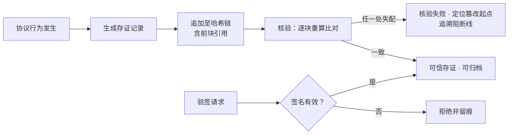

# PA-005 · 存证记录生命周期与追溯阻断线（防御性公开披露）

> **Disclosure Date**: 2026-09-16（UTC+8）
> **Public Commit**: `9c88f98`（github.com/henyi-tdca/tdca-protocol，main 分支）
> **性质**：防御性公开（defensive publication）。本文构成可供审查比对的现有技术资料；采信与否取决于受理机关。

---

## 一、技术目的

为协议行为提供不可变、可追溯的存证生命周期管理：所有事实、授权、状态变更以追加式哈希链记录（每块含前块哈希引用，篡改沿链传播、立即可检）；存证记录自生成、链式追加、完整性核验、签名验证到归档的生命周期全程机器可复算；对试图伪造或篡改的行为设追溯阻断线——验签失败、链不一致即拒绝并留痕。

## 二、输入 / 输出

- **输入**：存证载荷（类型：fact / auth / mou / state / service）、签名者公钥引用、时间戳。
- **输出**：存证记录（标识、内容哈希、前块哈希、时间戳、签名字段、负空间触发标记）；链完整性核验结论（true / false）；验签结论。

## 三、触发条件

1. 任一协议行为发生 ⟹ 生成存证记录并追加至链（append-only，无存证 = 未发生）；
2. 任意时刻可对链执行完整性核验（逐块重算哈希并比对前块引用）；
3. 验签接口调用 ⟹ 签名无效即拒绝（密钥材料永不落盘）；
4. 链中任一块被篡改 ⟹ 后续块哈希连锁失配，核验失败并定位起点（追溯阻断线）。

## 四、执行流程

1. 生成：`NewRecord` 构造记录（8 字段轻量同构 ＋ 全量字段）；
2. 链式追加：`Chain.Append` —— 记录哈希含前块哈希链式引用；并发安全（读写锁）；
3. 核验：`Chain.Verify` 逐块重算并比对，任一失配 ⟹ 返回 false；
4. 验签：`VerifySignature` —— 签名无效 ⟹ 返回错误；
5. 快照：`Snapshot` 导出链状态，供归档与审计；
6. 生命周期协同：断言类存证的状态迁移（proposed / active / overruled）经锚点机制管理（见 PA-003）；负空间触发标记写入记录 `nsfl` 字段（见 PA-002）。

## 五、实施例（公开仓代码）

- 存证链：`core-go/pkg/nca/nca.go`（`NcaRecord` 字段结构／`RecordHash` 链式哈希／`Chain.Append` 追加／`Chain.Verify` 完整性核验／`VerifySignature` 验签接口／`Snapshot` 快照；与 Python 版输出 JSON 兼容）。
- 断言生命周期：`core-go/pkg/nca/anchor.go`（三态迁移上链，见 PA-003）。

## 六、流程图

## 七、可实现性自查

| # | 项 | 结论 |
|---|---|---|
| ① | 技术目的 | §一 |
| ② | 输入/输出 | §二 |
| ③ | 触发条件 | §三 |
| ④ | 执行流程 | §四 |
| ⑤ | 实施例（公开仓代码路径） | §五（2 处路径，commit `9c88f98` 可核） |
| ⑥ | 状态机/流程图 | §六（Mermaid） |
| ⑦ | Disclosure Date ＋ 公开仓 commit | 文件头 |
